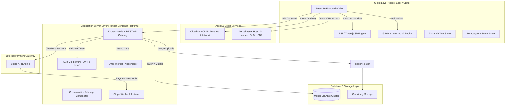
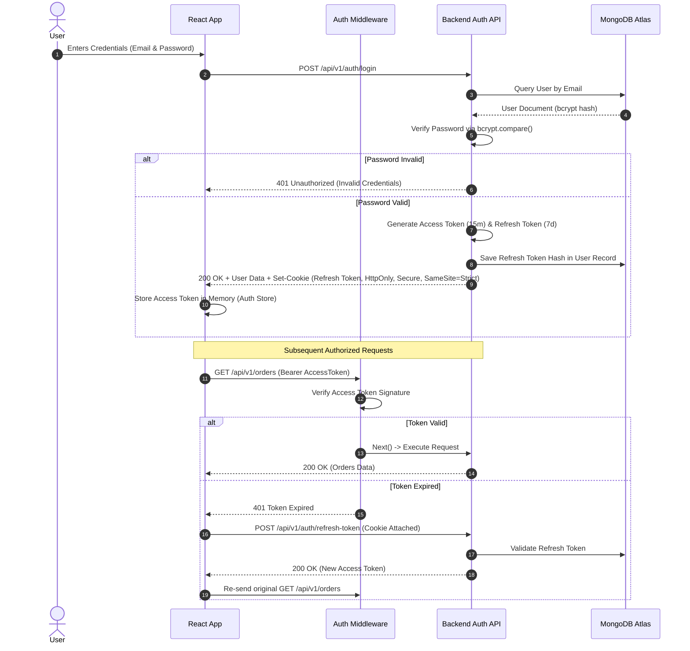
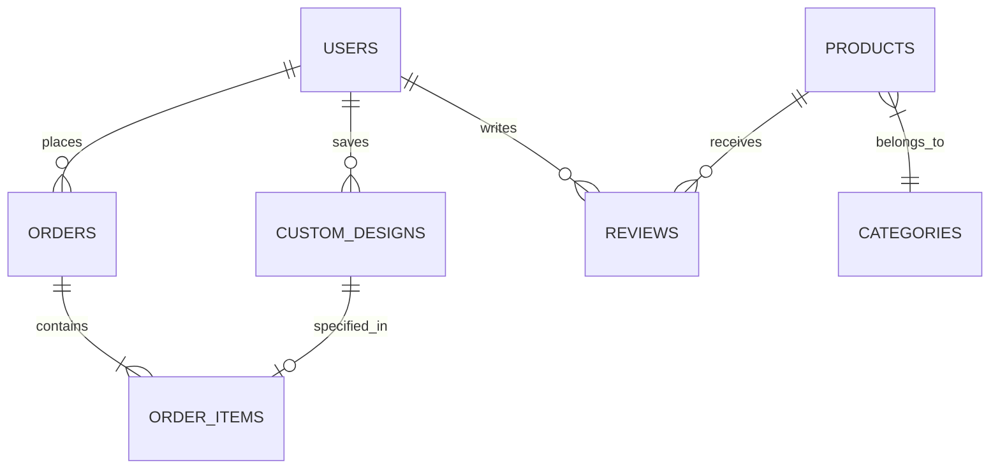

# GEEK HELL - PRODUCTION ARCHITECTURE SPECIFICATION (PHASE 01)

> [!IMPORTANT]
> **PHASE 01 ARCHITECTURE ONLY**: This document establishes the master blueprint for the Geek Hell platform. Zero implementation code, React components, Express routes, or database model files are generated in this phase. All future engineering work will strictly follow this architectural contract.

---

## 1. High-Level System Architecture

Geek Hell is designed as a decoupled, micro-services-ready, headless e-commerce & 3D WebGL customization platform. The system operates on a client-server architecture with dynamic edge distribution and real-time state management.



---

## 2. Project Folder Structure

The project will use a mono-repo structure with separate `client` and `server` directories to maintain clean boundaries between frontend rendering logic and backend application logic.

```
geek-hell/
├── .github/
│   └── workflows/
│       ├── frontend-ci.yml
│       └── backend-ci.yml
├── client/                               # React 19 Frontend App
│   ├── public/
│   │   ├── models/                       # 3D assets (.glb / .gltf)
│   │   │   ├── tshirt_front_back.glb
│   │   │   ├── hoodie_base.glb
│   │   │   └── mannequin.glb
│   │   ├── textures/                     # Default canvas & fabric textures
│   │   ├── fonts/                        # Local typography assets
│   │   └── favicon.ico
│   ├── src/
│   │   ├── assets/                       # Static UI imagery & vector icons
│   │   ├── components/                   # Reusable UI primitives
│   │   │   ├── ui/                       # Buttons, Modals, Inputs (Glassmorphism)
│   │   │   ├── layout/                   # Navbar, Footer, Sidebar, PageContainer
│   │   │   ├── animations/               # Animated wrappers (SmoothScroll, Transition)
│   │   │   └── feedback/                 # Loaders, Toasts, Error Boundaries
│   │   ├── features/                     # Domain-driven feature modules
│   │   │   ├── auth/                     # Login, Register, Forgot Password
│   │   │   ├── shop/                     # Catalog, Filters, Product Cards
│   │   │   ├── designer3d/               # 3D Canvas, Controls, Decal Controls
│   │   │   ├── cart/                     # Cart Drawer, Item Rows, Price Summary
│   │   │   ├── checkout/                 # Stripe Form, Address Step, Order Summary
│   │   │   ├── profile/                  # User info, Saved Designs, Order History
│   │   │   ├── admin/                    # Admin Dashboard management features
│   │   │   └── wishlist/                 # Wishlist drawer & grid
│   │   ├── hooks/                        # Custom React Hooks
│   │   │   ├── use3DTexture.ts           # Texture mapping & composition hook
│   │   │   ├── useGSAPTimeline.ts        # GSAP controller hook
│   │   │   ├── useLenisScroll.ts         # Smooth scroll initializer
│   │   │   └── useDebounce.ts
│   │   ├── store/                        # Client state management (Zustand)
│   │   │   ├── useDesignerStore.ts       # 3D Editor active state
│   │   │   ├── useCartStore.ts           # Local cart state & persistence
│   │   │   ├── useAuthStore.ts           # User auth & token state
│   │   │   └── useUIStore.ts             # Modals, drawers, theme state
│   │   ├── services/                     # Axios API clients & endpoints
│   │   │   ├── api.ts                    # Axios Base Instance
│   │   │   ├── authService.ts
│   │   │   ├── productService.ts
│   │   │   ├── designerService.ts
│   │   │   └── checkoutService.ts
│   │   ├── types/                        # Global TypeScript interfaces & types
│   │   │   ├── product.d.ts
│   │   │   ├── designer.d.ts
│   │   │   ├── user.d.ts
│   │   │   ├── order.d.ts
│   │   │   └── api.d.ts
│   │   ├── utils/                        # Pure utility functions
│   │   │   ├── formatters.ts             # Currency, date, string utilities
│   │   │   ├── canvasUtils.ts            # Off-screen canvas texturing helpers
│   │   │   └── validators.ts            # Zod validation schemas
│   │   ├── styles/
│   │   │   ├── index.css                 # Base Tailwind & Custom Glassmorphism styles
│   │   │   └── animations.css            # Custom CSS keyframes
│   │   ├── pages/                        # Route components
│   │   │   ├── HomePage.tsx
│   │   │   ├── ShopPage.tsx
│   │   │   ├── ProductDetailPage.tsx
│   │   │   ├── DesignerPage.tsx
│   │   │   ├── CartPage.tsx
│   │   │   ├── CheckoutPage.tsx
│   │   │   ├── WishlistPage.tsx
│   │   │   ├── ProfilePage.tsx
│   │   │   ├── AdminDashboardPage.tsx
│   │   │   └── NotFoundPage.tsx
│   │   ├── router/                       # React Router configuration
│   │   │   ├── index.tsx
│   │   │   ├── ProtectedRoute.tsx
│   │   │   └── AdminRoute.tsx
│   │   ├── App.tsx
│   │   └── main.tsx
│   ├── index.html
│   ├── tailwind.config.js
│   ├── vite.config.ts
│   ├── tsconfig.json
│   └── package.json
│
└── server/                               # Node.js + Express Backend App
    ├── src/
    │   ├── config/                       # DB, Stripe, Cloudinary connection configs
    │   │   ├── db.ts
    │   │   ├── cloudinary.ts
    │   │   ├── stripe.ts
    │   │   └── jwt.ts
    │   ├── controllers/                  # Request handles logic
    │   │   ├── authController.ts
    │   │   ├── productController.ts
    │   │   ├── categoryController.ts
    │   │   ├── designerController.ts
    │   │   ├── cartController.ts
    │   │   ├── orderController.ts
    │   │   ├── reviewController.ts
    │   │   ├── adminController.ts
    │   │   └── webhookController.ts
    │   ├── middleware/                   # Express custom middlewares
    │   │   ├── authMiddleware.ts         # JWT Verification & User attaching
    │   │   ├── rbacMiddleware.ts         # Role verification (Admin checks)
    │   │   ├── errorMiddleware.ts        # Global error interceptor
    │   │   ├── rateLimiterMiddleware.ts  # Express Rate Limit strategy
    │   │   └── uploadMiddleware.ts       # Multer memory storage router
    │   ├── models/                       # Mongoose Database Schemas
    │   │   ├── User.ts
    │   │   ├── Product.ts
    │   │   ├── Category.ts
    │   │   ├── Order.ts
    │   │   ├── CustomDesign.ts
    │   │   ├── Review.ts
    │   │   ├── Coupon.ts
    │   │   └── Analytics.ts
    │   ├── routes/                       # Express Endpoints Definition
    │   │   ├── authRoutes.ts
    │   │   ├── productRoutes.ts
    │   │   ├── categoryRoutes.ts
    │   │   ├── designerRoutes.ts
    │   │   ├── orderRoutes.ts
    │   │   ├── reviewRoutes.ts
    │   │   ├── adminRoutes.ts
    │   │   └── webhookRoutes.ts
    │   ├── services/                     # Business Logic Services
    │   │   ├── authService.ts
    │   │   ├── stripeService.ts
    │   │   ├── cloudinaryService.ts
    │   │   ├── mailService.ts
    │   │   └── analyticsService.ts
    │   ├── utils/                        # Server helpers & custom classes
    │   │   ├── ApiError.ts               # Extended Error class
    │   │   ├── ApiResponse.ts            # Standardized API output wrapper
    │   │   ├── asyncHandler.ts           # Async wrap function
    │   │   └── logger.ts                 # Structured logger (Winston/Pino)
    │   ├── validators/                   # Server-side Zod/Joi validations
    │   │   ├── authValidator.ts
    │   │   ├── productValidator.ts
    │   │   └── orderValidator.ts
    │   ├── app.ts                        # Express app initialization
    │   └── server.ts                     # HTTP Listener entry point
    ├── .env.example
    ├── tsconfig.json
    └── package.json
```

---

## 3. Feature Breakdown

### A. Customer Website Features
- **Cinematic Homepage**: Awwwards-style hero section featuring 3D ambient garment view, GSAP text reveals, Lenis smooth scrolling, Marvel red and DC blue reactive accent lighting.
- **Product Catalog & Filtering**: Multi-attribute filtering (Category, Superhero Franchise, Size, Color, Price, Popularity), instant query state updates via React Query.
- **Product Details & Interactive Preview**: 360-degree interactive 3D model view with custom decal layer previews, rich typography, and stock checks.
- **Real-Time 3D T-Shirt & Apparel Designer**:
  - Interactive WebGL canvas (R3F + Drei).
  - Multi-angle camera views (Front, Back, Left Sleeve, Right Sleeve).
  - Real-time custom artwork upload with dynamic texture projection.
  - Interactive transform tools (Move, Scale, Rotate, Flip, Color shift).
  - High-resolution off-screen canvas composition rendering for production printing.
  - Save custom configuration to user profile or add directly to shopping cart.
- **Shopping Cart & Checkout**:
  - Slide-over glassmorphic shopping cart with real-time price calculations.
  - Secure multi-step checkout powered by Stripe Payment Elements.
- **User Dashboard**: Order history tracker with status indicators, saved 3D apparel designs gallery, wishlist grid, and profile management.

### B. Admin Dashboard Features
- **Executive Analytics Engine**: Visual sales breakdown, revenue graphs, design customization metrics, top-performing superhero lines.
- **Catalog Management**: CRUD operations for products, categories, base 3D models, textures, and colorways.
- **Customization Print Library**: View and download high-res user customization print files (PNG maps + coordinates) generated for order fulfillment.
- **Order Fulfillment Pipeline**: Update fulfillment status (Pending -> Printing -> Quality Check -> Shipped -> Delivered) with automated customer email triggers.
- **Coupons & Promotional Engine**: Create custom discount codes (Percentage, Fixed Amount, Minimum Spend) with usage caps.
- **Homepage Customization**: Manage featured hero products, banner messaging, and superhero theme spotlighting.

---

## 4. Module Responsibilities

| Module | Primary Responsibility | Technical Boundaries |
| :--- | :--- | :--- |
| `Auth Module` | Token generation, verification, password security, session persistence | JWT in HttpOnly cookies, bcrypt hashing |
| `3D Designer Module` | 3D garment rendering, raycasting, dynamic texture projection, screenshot snapshotting | React Three Fiber, Three.js, DecalGeometry, Canvas API |
| `Product Catalog Module` | Fetching, searching, indexing, and presenting product listings | React Query caching, MongoDB indexed queries |
| `Cart & Checkout Module` | Client-side state persistence, checkout session creation, order verification | Zustand persist middleware, Stripe API |
| `Media Upload Module` | Handling binary image uploads, resizing, CDN optimization, print-ready file generation | Multer, Cloudinary API, Sharp / Canvas API |
| `Admin Management Module` | System maintenance, order processing, stock adjustment, analytical reporting | RBAC middleware, MongoDB aggregation pipelines |
| `Animation Module` | Page transitions, interactive scroll reveals, camera positioning | GSAP, ScrollTrigger, Lenis, Framer Motion |

---

## 5. Data Flow Diagram (Text Format)

### Custom Product Creation to Order Lifecycle

```
[User Uploads Image / Custom Text]
          │
          ▼
[React 3D Designer Canvas (R3F)]
  ├── Render texture on WebGL Mesh via Decal Geometry
  └── Update Zustand `useDesignerStore` (X, Y, Scale, Rotation, Color, BaseModelId)
          │
          ▼
[User Clicks "Add Customized Item to Cart"]
  ├── Render off-screen high-res composite image (2048x2048 PNG)
  ├── Upload composite preview to Cloudinary via Server Endpoint
  └── Append item payload (Product ID, Design Coordinates, Cloudinary URL, Price, Size) to `useCartStore`
          │
          ▼
[User Proceeds to Checkout]
  ├── POST `/api/v1/checkout/create-session` (Payload: Cart Items, Shipping Address)
  ├── Backend validates inventory, calculates total + taxes + shipping
  └── Returns Stripe Client Secret
          │
          ▼
[User Completes Stripe Payment]
  ├── Stripe sends `checkout.session.completed` Webhook to Backend
  ├── Backend updates database: Creates Order with status `Paid` & `In-Fulfillment`
  ├── Stores 3D Design JSON specifications & print-ready assets link for factory
  └── Triggers Nodemailer email service with order confirmation PDF/HTML
```

---

## 6. Authentication Flow

The system employs a hybrid JWT architecture using short-lived Access Tokens and long-lived Refresh Tokens stored securely.



---

## 7. API Architecture

The API follows strict RESTful conventions, returning standardized JSON payloads. All endpoint responses are wrapped in an `ApiResponse` interface.

### Standardized Response Contract

```json
{
  "success": true,
  "statusCode": 200,
  "message": "Operation executed successfully",
  "data": {},
  "errors": null,
  "meta": {
    "timestamp": "2026-07-22T20:35:24.000Z",
    "page": 1,
    "limit": 20,
    "total": 100
  }
}
```

### Endpoints Specification Summary

#### Authentication Routes (`/api/v1/auth`)
- `POST /register`: User account creation.
- `POST /login`: Credential validation & token issue.
- `POST /logout`: Invalidates refresh token & clears cookie.
- `POST /refresh-token`: Rotates access token.
- `GET /me`: Returns current authenticated session details.

#### Product & Category Routes (`/api/v1/products`)
- `GET /`: Search, filter, and paginate products.
- `GET /:slug`: Fetch single product with associated 3D base mesh meta.
- `POST /` (Admin): Create product with 3D texture mappings.
- `PUT /:id` (Admin): Update product specs.
- `DELETE /:id` (Admin): Soft-delete product.

#### 3D Designer Routes (`/api/v1/designer`)
- `POST /upload-decal`: Upload custom artwork image file (Multer -> Cloudinary).
- `POST /save-design`: Save custom design JSON configuration to profile.
- `GET /saved-designs`: Fetch user's saved 3D custom configurations.

#### Order & Checkout Routes (`/api/v1/orders`)
- `POST /create-checkout-session`: Validate cart & generate Stripe session.
- `GET /my-orders`: Retrieve user order history.
- `GET /:id`: Retrieve detailed order summary & tracking status.
- `PATCH /:id/status` (Admin): Update order fulfillment status.

#### Webhook Routes (`/api/v1/webhooks`)
- `POST /stripe`: Raw body listener for Stripe payment confirmation events.

---

## 8. Database Architecture (MongoDB / Mongoose Schemas)

The database schema is optimized for document embedding where access patterns demand high performance (e.g., cart items, order line items) and referencing where entity relationships grow independently.

### Entity Relationship & Schema Blueprint



### Schema Definitions (Conceptual Field Mappings)

#### 1. User Entity
- `_id`: ObjectId
- `name`: String (Required)
- `email`: String (Unique, Indexed)
- `password`: String (Hashed via bcrypt)
- `role`: Enum (`'user'`, `'admin'`)
- `avatar`: String (Cloudinary URL)
- `refreshToken`: String (Hashed)
- `shippingAddresses`: Array of Address Objects
- `wishlist`: Array of ObjectIds (Ref: `Product`)
- `createdAt`, `updatedAt`: Timestamps

#### 2. Product Entity
- `_id`: ObjectId
- `title`: String (Required, Indexed)
- `slug`: String (Unique, Indexed)
- `description`: String
- `price`: Number (Required)
- `discountPrice`: Number
- `category`: ObjectId (Ref: `Category`, Indexed)
- `franchiseTag`: Enum (`'Marvel'`, `'DC'`, `'GeekOriginal'`, `'Anime'`)
- `baseModelUrl`: String (Path to `.glb` file)
- `availableColors`: Array of `{ name, hex, textureMapUrl }`
- `availableSizes`: Array of Enum (`'XS'`, `'S'`, `'M'`, `'L'`, `'XL'`, `'2XL'`)
- `stockInventory`: Number
- `isCustomizable`: Boolean (Default: `true`)
- `decalPlacementBounds`: Object `{ front: { x, y, width, height }, back: {...} }`
- `ratingsAverage`: Number (Default: `0`)
- `ratingsQuantity`: Number (Default: `0`)
- `createdAt`, `updatedAt`: Timestamps

#### 3. CustomDesign Entity (3D Designer Output)
- `_id`: ObjectId
- `user`: ObjectId (Ref: `User`, Indexed)
- `baseProduct`: ObjectId (Ref: `Product`)
- `designTitle`: String
- `canvasState`: Object
  - `selectedColor`: String
  - `decals`: Array of:
    - `position`: `{ x: Number, y: Number, z: Number }`
    - `scale`: `{ x: Number, y: Number }`
    - `rotation`: Number
    - `decalImageUrl`: String
    - `printSide`: Enum (`'front'`, `'back'`, `'left_sleeve'`, `'right_sleeve'`)
- `previewImageUrl`: String (Generated Composite PNG)
- `highResPrintUrl`: String (2048x2048 Print Ready asset)
- `createdAt`: Timestamp

#### 4. Order Entity
- `_id`: ObjectId
- `orderNumber`: String (Unique, Auto-generated)
- `user`: ObjectId (Ref: `User`, Indexed)
- `items`: Array of:
  - `product`: ObjectId (Ref: `Product`)
  - `customDesign`: ObjectId (Ref: `CustomDesign`, Optional)
  - `selectedSize`: String
  - `selectedColor`: String
  - `quantity`: Number
  - `unitPrice`: Number
- `shippingAddress`: Object
- `paymentInfo`:
  - `stripePaymentIntentId`: String
  - `status`: Enum (`'Pending'`, `'Paid'`, `'Failed'`, `'Refunded'`)
- `fulfillmentStatus`: Enum (`'Processing'`, `'Printing'`, `'QualityCheck'`, `'Shipped'`, `'Delivered'`)
- `subtotal`: Number
- `taxAmount`: Number
- `shippingFee`: Number
- `totalAmount`: Number
- `trackingNumber`: String
- `createdAt`, `updatedAt`: Timestamps

---

## 9. Frontend Architecture

The frontend uses an atomic, feature-folder pattern powered by React 19 and Vite.

### Core Architectural Layers
1. **Presentation Layer**: Functional components enhanced with Tailwind CSS glassmorphic utility classes and Framer Motion micro-interactions.
2. **3D Scene Layer**: React Three Fiber canvas hierarchy with Drei extensions, managing lighting, dynamic shadows, camera trajectories, and mesh decal geometry projection.
3. **Animation Engine Layer**: GSAP ScrollTrigger timeline management coupled with Lenis smooth scrolling for luxury editorial transitions.
4. **Data Management Layer**: Zustand stores for synchronous UI/Editor state; React Query for asynchronous server synchronization, caching, and optimistic UI mutations.

---

## 10. Backend Architecture

The backend is built with Node.js and Express using a controller-service-repository layered architectural pattern.

```
[HTTP Request] ──► [Express Router] ──► [Auth / RateLimit Middleware]
                                                │
                                                ▼
[Response JSON] ◄── [Controller] ◄──► [Service Layer (Business Rules)]
                                                │
                                                ▼
                                    [Mongoose Repository Layer]
                                                │
                                                ▼
                                      [(MongoDB Atlas DB)]
```

### Layer Responsibilities
- **Middleware Layer**: Handles security (Helmet, CORS), rate limiting, JWT token extraction, role validation, file upload parsing (Multer), and global exception capturing.
- **Controller Layer**: Handles HTTP request parsing, input data sanitation via Zod validation schemas, delegating work to services, and returning standardized `ApiResponse` objects.
- **Service Layer**: Implements core business logic (e.g., calculation of total charges, communicating with Stripe API, managing Cloudinary uploads, sending transaction emails).
- **Repository / Model Layer**: Encapsulates database queries using Mongoose models with custom static helper methods and schema validation.

---

## 11. State Management Architecture

State is cleanly partitioned between synchronous client UI state and asynchronous server cached state to prevent state duplication and sync issues.

```mermaid
graph LR
    subgraph Client State (Zustand)
        A[useAuthStore] -->|User / Token| Client
        B[useDesignerStore] -->|Active 3D Decals & Color| Client
        C[useCartStore] -->|Persisted Local Items| Client
        D[useUIStore] -->|Drawers / Modals / Accent Theme| Client
    end

    subgraph Server State (React Query)
        E[Product Catalog Cache] -->|Stale Time: 5m| Client
        F[Order History Cache] -->|Stale Time: 1m| Client
        G[User Profile Data] -->|Stale Time: 10m| Client
    end
```

---

## 12. 3D Designer Architecture

The 3D T-Shirt & Apparel Designer is the cornerstone feature of Geek Hell. It requires a dedicated rendering and texture transformation pipeline.

```mermaid
graph TD
    subgraph 3D Rendering Pipeline (R3F + Three.js)
        A[GLTFLoader] -->|Loads .GLB Base Garment| B[ Garment Mesh ]
        C[User Upload / Decal Select] -->|Texture Loader| D[ Decal Texture Canvas ]
        E[Zustand useDesignerStore] -->|Position / Scale / Rotation State| F[ R3F Decal Component ]
        B --> F
        D --> F
        F -->|Render Loop (60 FPS)| G[ Dynamic Shadow & Lighting Canvas ]
    end

    subgraph High-Res Export Pipeline
        H[User Clicks Save/Add to Cart] --> I[Off-screen WebGL Render Buffer]
        I -->|2048x2048 Snapshot| J[PNG Canvas Data Blob]
        J -->|Upload API| K[Cloudinary Print Asset CDN]
    end
```

### Technical 3D Specifications
- **Garment Mesh Specifications**: Low-poly clean topology (.GLB format < 5MB) with pre-baked normal maps for realistic fabric folds, wrinkles, and stitching detail.
- **Decal Projection**: Uses `@react-three/drei` `<Decal>` geometry projection, wrapping decal textures seamlessly around 3D mesh curvature without texture distortion.
- **Camera Controls**: OrbitControls with locked vertical polar angles, smooth damping (`dampingFactor = 0.05`), and preset camera viewpoints (Front: `[0, 0, 2.5]`, Back: `[0, 0, -2.5]`, Sleeves: `[2.5, 0, 0]`).
- **Dynamic Lighting**: Studio environment preset with soft ambient light, key directional light with shadow mapping, and dynamic Marvel-red/DC-blue rim lights.

---

## 13. Animation Architecture

To achieve an Awwwards-winning cinematic look, animations are structured into multi-tiered performance layers.

### 1. Scroll Engine Layer (Lenis + GSAP ScrollTrigger)
- **Lenis Smooth Scroll**: Intercepts native browser scrolling, providing consistent smooth inertia across devices.
- **GSAP ScrollTrigger Integration**: Synchronized with Lenis animation frames via `lenis.on('scroll', ScrollTrigger.update)`.
- **Cinematic Parallax & Pinning**: Garment models and superhero title typography pin dynamically on scroll, rotating 360 degrees as the user explores sections.

### 2. Page & Layout Transitions (Framer Motion)
- **AnimatePresence**: Handles seamless route change transitions with glassmorphic fade-and-scale reveals.
- **Micro-Interactions**: Hover micro-springs on cards, custom cursor glowing trails in Marvel red / DC blue based on context.

---

## 14. Deployment Architecture

```mermaid
graph LR
    subgraph Source Code
        Repo[GitHub Monorepo]
    end

    subgraph CI/CD Pipelines
        GH[GitHub Actions Pipeline]
    end

    subgraph Frontend Target
        Vercel[Vercel Edge Platform]
    end

    subgraph Backend Target
        Render[Render Web Service Container]
    end

    subgraph Database & Media Target
        Atlas[(MongoDB Atlas Global Cluster)]
        Cloudinary[Cloudinary Media CDN]
    end

    Repo -->|Push to main| GH
    GH -->|Lint & Test| GH
    GH -->|Deploy Web App| Vercel
    GH -->|Deploy API Service| Render
    Render <--> Atlas
    Render <--> Cloudinary
    Vercel <--> Cloudinary
```



---

## 15. Scalability Strategy

- **Stateless Application Server**: Node.js instance maintains zero local session state. All session information resides in JWT tokens and database stores, allowing seamless horizontal scaling across Render container instances.
- **Database Indexing & Caching**: MongoDB collection fields (`slug`, `email`, `category`, `franchiseTag`, `orderNumber`) are indexed. Product catalog endpoints employ HTTP cache headers and React Query caching.
- **CDN Edge Asset Distribution**: 3D `.glb` assets and high-resolution textures are cached at the network edge via Cloudinary and Vercel CDN, ensuring fast load times worldwide.

---

## 16. Security Strategy

- **Authentication Security**: JWT Access Tokens stored in-memory (Zustand); Refresh Tokens issued via `HttpOnly`, `Secure`, `SameSite=Strict` cookies.
- **Password Protection**: Passwords salted and hashed with `bcryptjs` (Cost factor: 12).
- **HTTP Security Headers**: Express app secured with `helmet()` middleware (CSP, X-Frame-Options, HSTS).
- **Rate Limiting**: Express Rate Limit applied to authentication (`10 requests / 15 mins`) and general API endpoints (`100 requests / 15 mins`).
- **Input Sanitation & Validation**: All incoming body parameters validated against strict Zod schemas to eliminate Injection attacks and invalid payload execution.
- **CORS Protection**: Restricted to explicitly whitelisted origin domain(s).

---

## 17. Performance Strategy

- **Code Splitting & Lazy Loading**: React components for 3D Designer, Admin Dashboard, and Checkout routes lazy-loaded via `React.lazy()` and `Suspense`.
- **Three.js Asset Optimization**:
  - 3D models compressed using Draco mesh compression (`.glb` size reduced by ~70%).
  - Texture maps mipmapped and limited to 2K resolution max for real-time rendering.
- **Target Frame Rate**: 3D rendering pipeline throttled and optimized to maintain **60 FPS** on mid-tier mobile and desktop GPU devices.
- **Asset Preloading**: Preloading critical home hero 3D GLB mesh assets via `<link rel="preload">` tags during loading screen display.

---

## 18. Future Expansion Plan

- **Mobile Application**: Reuse React Native / Expo codebase leveraging existing REST API and database architecture.
- **AR (Augmented Reality) Try-On**: Integrate WebXR / Apple Quick Look `.usdz` exports to allow users to view 3D custom apparel in their real-world environment via smartphone camera.
- **AI Design Generator**: Integrate OpenAI DALL-E 3 / Midjourney API to allow users to generate superhero vector artwork directly within the 3D designer canvas via text prompts.
- **Multi-Vendor Creator Marketplace**: Allow community artists to publish custom 3D apparel designs, earn royalties, and receive creator payouts.

---

## Architecture Approval Checklist

Please review the architectural checklist below before approving execution:

- [ ] **High-Level Architecture**: Decoupled client-server design approved.
- [ ] **Folder Structure**: Mono-repo structure (`client/` and `server/`) verified.
- [ ] **Tech Stack**: React 19, Vite, R3F, Three.js, GSAP, Node.js, Express, MongoDB Atlas confirmed.
- [ ] **3D Designer Pipeline**: R3F + DecalGeometry + Canvas export pipeline accepted.
- [ ] **Database Schemas**: User, Product, CustomDesign, Order, and Review structures approved.
- [ ] **Security Architecture**: JWT in HttpOnly cookie + Helmet + Zod validation accepted.
- [ ] **Deployment Strategy**: Vercel (Frontend) + Render (Backend) + Cloudinary (Media) confirmed.

---
*End of Phase 01 Architecture Specification.*
